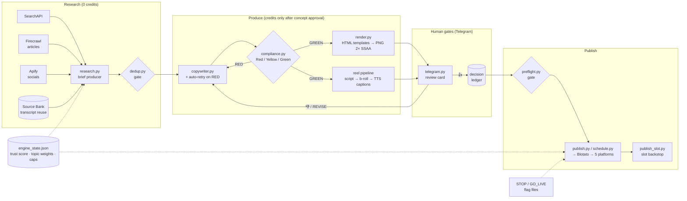

# Content Engine

An autonomous, human-gated social-content production system that researched, wrote, rendered, and published multi-format content (posts, carousels, reels, stories) for a real DTC e-commerce brand — running in production on a five-slot daily schedule across Instagram, TikTok, X, Facebook, and YouTube.

> **Provenance:** this is the real production system, published with the client's branding replaced by the placeholder **"Acme"** and people replaced by pseudonyms. Brand assets (logos, product photography, licensed fonts) and agent-identity files were removed. Everything else — code, tests, docs, and the curated commit history — is the system as it ran.

## Why it's architecturally interesting

Most "AI content bots" are a prompt and a cron job. This one had to survive three hard constraints:

1. **A regulated vertical.** The brand sells research compounds — every claim is a compliance risk. The engine treats compliance as a *first-class authority*, not a filter bolted on at the end.
2. **Real money per generation.** Video/image generation spends credits. The pipeline is **credit-first**: every expensive step sits behind a gate, and research/scripting/captioning are engineered to cost zero.
3. **A human owner who must stay in control.** Nothing publishes without an explicit human 👍 in Telegram. The system is autonomous *between* gates, never *across* them.

## Architecture

Three loop orchestrators sit on a shared core (`engine.py`): **produce** (`produce_daily.py`), **review** (`telegram.py` / `approvals.py`), **publish** (`publish_slot.py`), wired to macOS `launchd` timers ([launchd/](launchd/)).

## Design decisions worth stealing

| Decision | Why |
|---|---|
| **Compliance as a single authority** ([compliance.py](compliance.py)) | One Red/Yellow/Green claims engine consulted by *every* layer (copywriter, preflight, publish) instead of per-step regex. FDA/Meta hard-stop lists live in exactly one place; the copywriter auto-retries on RED. |
| **Credit-first state machine** | The reel pipeline is 6 stages; the only credit spend (b-roll generation) happens *after* the concept is human-approved. Research, scripts, TTS voiceover, and synced captions all cost $0. Double-spend was a real production incident — the fix is a status-driven state machine, not a retry guard. |
| **Two-gate publishing** | Gate 1: concept approval before money. Gate 2: final artifact approval before the publisher. Approval decisions land in an append-only **decision ledger** that also steers future generation *away* from rejected concepts. |
| **Dedup as a gate, not a report** ([dedup.py](dedup.py)) | Draft→dedup gate with a used-reference ledger and a 7-day product window; the engine refuses to ship a near-duplicate rather than flagging it after the fact. |
| **Trust score / graduated autonomy** | `engine_state.json` tracks consecutive clean approvals; posting rate is a function of earned trust, with a compliance-hold bit that freezes the loop. |
| **Kill switches over dashboards** | `touch output/STOP` halts everything; `GO_LIVE` flips dry-run → live. Operable from any shell, no UI to build or break. |
| **Per-day spend caps** | Copy/search/extraction API budgets enforced in the shared core, plus Telegram alerts when any upstream API is depleted. |
| **Slot-driven theming** | Dark/light theme follows the *assigned posting slot* (morning = light), not the content pillar — found the hard way when a dedup-heavy day stacked one pillar into morning slots. |

## Stack

- **Python 3** (stdlib-heavy, flat modules — deliberately dependency-light, see [engine.py](engine.py))
- **LLM copy** via OpenRouter · **research** via SearchAPI + Firecrawl + Apify
- **Media generation** via Higgsfield (video/image) · **TTS + synced captions** via the reel pipeline (0-credit)
- **Rendering**: hand-built HTML template families ([templates/src/](templates/src/)) screenshotted at 2× supersampling
- **Review**: dedicated Telegram bot · **Publishing**: Blotato API → IG/TikTok/X/FB/YouTube
- **Scheduling**: `launchd` timers · **Tests**: 20 pytest suites over the gates, cadence, dedup, and state machine ([tests/](tests/))

## Repo map

Start at [docs/INDEX.md](docs/INDEX.md). Key reads: [docs/PIPELINE_RUNBOOK.md](docs/PIPELINE_RUNBOOK.md) (every production recipe + gotchas), [docs/CONTENT_ENGINE_GUIDE.md](docs/CONTENT_ENGINE_GUIDE.md) (strategy spec the engine implements), [schemas/](schemas/) (brief/decision contracts).

## What was removed for publication

Brand assets (logos, product photography, branded overlay templates), licensed font binaries, the OpenClaw agent-identity files (`SOUL.md`, `MEMORY.md`, …), and the private strategy PDF. Their absence breaks pixel-perfect template rendering but nothing else; the engine's logic, gates, and docs are complete.
